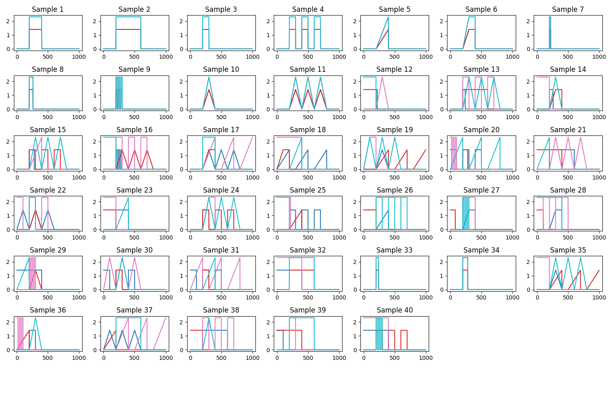
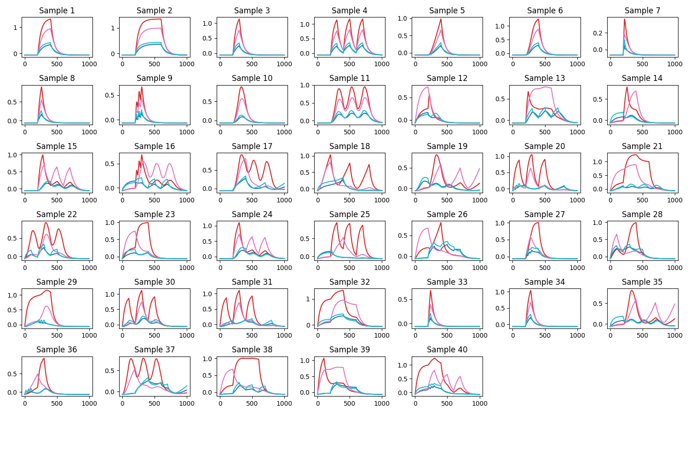

# CElegans-Stimulus-Data

## Install

```
pip install -r requirements.txt
```
Python 3.9 was used.

## Run
```
python3 main.py --method <TimeSHAP/SeqSHAP/BaseCE> [--reduce <percentage>] [--seed <value>] [--plot] [--torch] [--hidden_state] [--num_hidden_layers <value>] [--n_trials <value>]* [--no_local]** [--no_global]** [--no_cell]** [--verbose]** [--segmentation <derivative/distribution>]***
```

- `method` is a mandatory argument. It chooses the method to compute: `TimeSHAP` or `SeqSHAP`. If `BaseCE` is selected, then the base model is trained. For a model to be trained from scratch, delete `config/CE/BaseCE_<num_hidden>.db` and `datasets/CE/features/BaseCE_<num_hidden>.h5`. The arguments exclusively for model training are shown with \*, for TimeSHAP \*\*, and for SeqSHAP \*\*\*;

- `reduce` cuts the number of samples to the percentage indicated;

- `torch` uses the PyTorch model, not recommended. The default is the TensorFlow model;

- `hidden_state` allows the usage of hidden state while computing in TimeSHAP and SeqSHAP. This option is recommended;

- `num_hidden_layers` states how many hidden units are in the model. This number is indicated after `BaseCE`, and defaults to 16 units;

- `n_trials` chooses the number of hyperparameter choice trials while training the base model. Defaults to 50;

- `no_local` does not compute the local explanations in TimeSHAP;

- `no_global` does not compute the global explanations in TimeSHAP;

- `no_cell` does not compute the (local) cell-level explanations in TimeSHAP;

- `segmentation` allows the choice of the segmentation algorithm in SeqSHAP. `derivative` computes the novel algorithm, `distribution` is an adaptation of the proposed one in [SeqSHAP](https://openreview.net/forum?id=0h4_YLDhf4K).

### Data Analysis

The inputs of CE dataset:



The outputs of CE dataset:



```
python3 analysis.py [--model_type <NONE/VAR/VARMA>] [--data_type <INPUT/OUTPUT>] [--transformation <NONE/Z/LOG/SQRT/BOX-COX>]
```

`analysis.py` contains the transformations applied to the data. Arguments:

- `model_type` is the model to be fitted. Since the data does not follow a Gaussian value distribution, only `NONE` can be applied;
- `data_type` states the data to be analyzed, either input-only or output-only;
- `transformation` is a transformation applied to the data, with the objective of approximating it to a Gaussian distribution. `Z` performs a standardization (Z-score), `LOG` the natural logarithm, `SQRT` the square root, and `BOX-COX` applies the Box-Cox method from Scipy.stats.

`output` directory contains folders named `<data_type>_<transformation>`, where the results for this configuration are stored. To recompute the output, the folder must be deleted before running the code.

Inside each mentioned folder, the folder: `acf` contains the Autocorrelation graphs, `adf_tests` the Augmented Dickey-Fuller (stationarity) tests, `histograms` the value histogram graphs, `pacf` the Partial Autocorrelation graphs, `qqplots` the Q-Q plots (visual check for Gaussian distribution), `shapiro_tests` the Shapiro-Wilk tests (Gaussian distribution tests).

Note: ADF tests the null hypothesis of a unit root present in the series, if this hypothesis is true (high p-value), then the series is non-stationary. Shapiro-Wilk tests the null hypothesis of the data following a Gaussian distribution, if this hypothesis is true (high p-value), then the values of the series are Gaussian distributed.